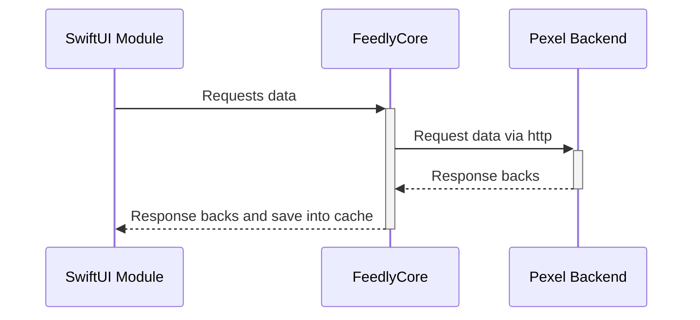
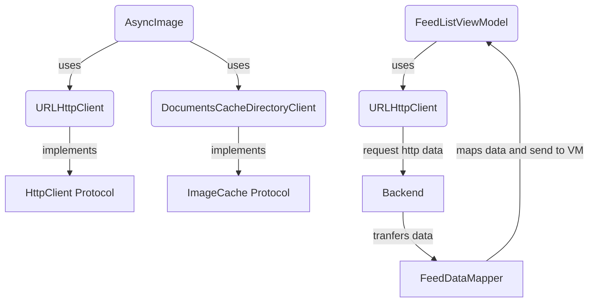

# Feedly

This application is a feed viewer that loads image and video feeds from the Pexels backend build by using Test Driven Development Approch (TDD). It provides a seamless user experience with features like video autoplay, image caching, and smooth scrolling. The application is built with a clean architecture, ensuring separation of concerns, testability, and maintainability through the use of **protocols** and adherence to **SOLID principles**. Application Code doesn't contain any of the thirdparty codes or librarys.

## Native Framework used:
- SwiftUI
- XCTest
- Combine
- Foundation

## Sequence Diagram

---

## FlowChart

---

## Features

### 1. **Load Image/Video Feeds from Pexels Backend**
   - Fetches image and video feeds from the Pexels API.
   - Displays feeds in a scrollable list for easy browsing.

### 2. **Autoplay Videos**
   - Automatically plays videos when the feed item becomes visible on the screen.
   - Pauses videos when the feed item goes out of the scroll view to save resources.

### 3. **Image Caching**
   - Implements image caching to improve performance.
   - Loads images from the cache on subsequent visits, reducing network usage and load times.

### 4. **Clean Architecture**
   - Uses domain and business-specific models to ensure clear separation of concerns.
   - Segregates data, domain, and presentation layers for better maintainability.

### 5. **Unit Testing**
   - Includes comprehensive unit tests to ensure the correctness of business logic.
   - Tests cover core functionalities like feed loading, caching and mapping of the models

### 5. **CI Pipeline**
   - Code includes Github Actions CI pipeline which runs all of the unit test in case of Pull Request

### 6. **Separate Frameork for Business Logic**
   - Application have a separate Framework called FeedlyCore, this framework contains platform independent business logic which can easily be imported in future MacOS, tvOS and watchOS application without the need of duplication.

### 7. **Protocol-Oriented Design**
   - Uses **protocols** extensively to define contracts between components.
   - Enables easy mocking and testing of dependencies.
   - Promotes loose coupling and high cohesion.
   - **Mocking**: Uses protocols to mock dependencies and isolate components for testing.

---

